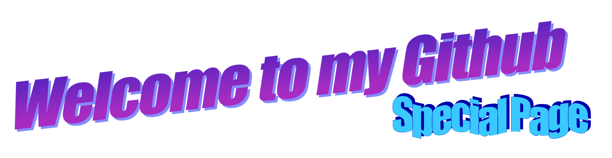
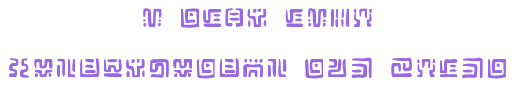
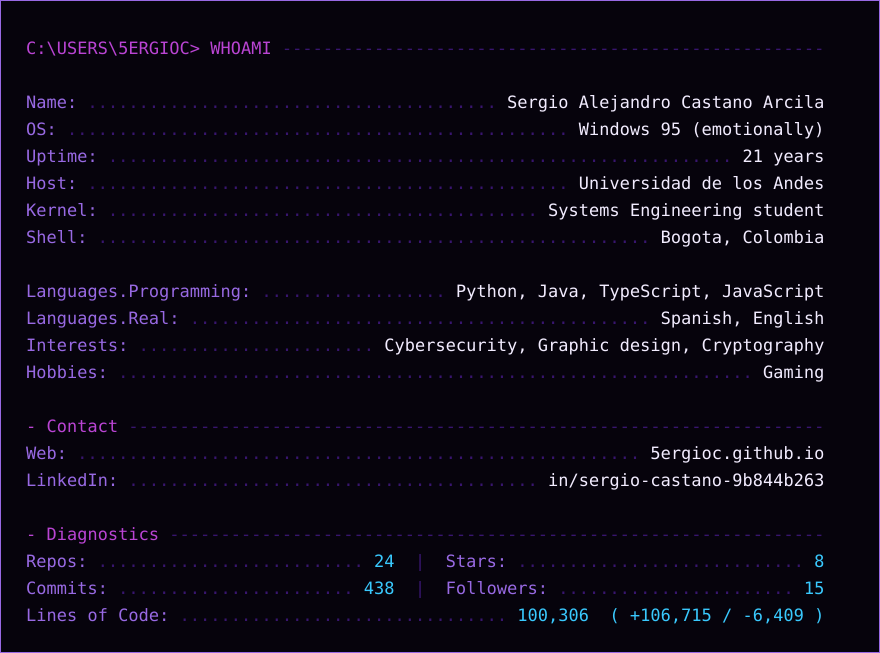
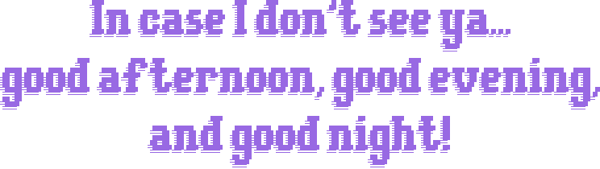
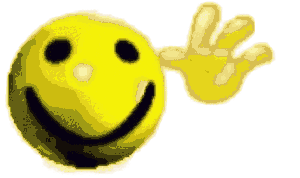

<!-- ═══════════════════════════════════════════════════════════════
     5ergioC :: PERFIL DE USUARIO  ·  v0.6
     GitHub elimina <style> y CSS inline. Solo sobreviven los
     atributos align/width/height y las etiquetas
     <div> <p>  <picture> <table> <pre> <details> <a> <sub>.

     Cero bloques ```text y cero texto suelto: cada pieza es un SVG
     o un PNG generado por los scripts de tools/, con su propio
     marco horneado y dos variantes de tema. Así nada depende de la
     tipografía ni del tema del visitante.
     Los colores salen todos de tools/palette.py: cambia ACTIVE ahí,
     vuelve a correr los scripts y la página entera se mueve junta.
     ═══════════════════════════════════════════════════════════════ -->

<div align="center">

<!-- ── HEADER · WORDART ────────────────────────────────────────── -->
<!-- Welcome.png tiene fondo transparente y tipografía morada/cian:
     legible en claro y en oscuro, así que no necesita <picture>. -->


<br><br>

<!-- ── SALUDO ─────────────────────────────────────────────────── -->
<!-- tools/build_greeting.py. El prompt se queda quieto, el saludo
     se escribe letra por letra y el cursor de bloque parpadea.
     Fondo transparente: la línea se apoya sobre la página en vez
     de traer su propio recuadro. -->
<picture>
  <source media="(prefers-color-scheme: dark)"  srcset="./Images/greeting-dark.svg">
  <source media="(prefers-color-scheme: light)" srcset="./Images/greeting-light.svg">
  
</picture>

<br><br>

<!-- ── RETRATO ASCII ANIMADO ───────────────────────────────────── -->
<!-- tools/build_portrait.py. La animación es SMIL puro (las filas
     entran de arriba abajo, una banda de scanline baja en bucle y
     el conjunto parpadea): camo deja pasar SMIL, igual que con la
     serpiente. Para rehacer la cara, el comando completo está en
     tools/README.md. -->
<picture>
  <source media="(prefers-color-scheme: dark)"  srcset="./Images/portrait-dark.svg">
  <source media="(prefers-color-scheme: light)" srcset="./Images/portrait-light.svg">
  
</picture>

<br><br>

<!-- ── NOTA EN COMIC SANS ──────────────────────────────────────── -->
<!-- tools/build_comic.py. GitHub no deja declarar tipografías, así
     que la única vía para Comic Sans es hornearla como imagen.
     PNG con canal alfa: sin fondo no hay recuadro que pelee con el
     tema del visitante. -->
<picture>
  <source media="(prefers-color-scheme: dark)"  srcset="./Images/interests-dark.png">
  <source media="(prefers-color-scheme: light)" srcset="./Images/interests-light.png">
  
</picture>

<br><br>

<!-- ── LÍNEA CIFRADA EN SHEIKAH ────────────────────────────────── -->
<!-- tools/build_sheikah.py. Dice "i also like cryptography and zelda".
     Cada glifo va como <path>: no depende de que el visitante tenga
     la fuente y no hace falta commitear el .ttf (está gitignorado).
     El corte de línea se controla con la lista LINES del script; el
     viewBox se mide de la tinta real, no del ascendente declarado.

     dcode.fr no sirve para esto: no tiene tipografía, arma la línea
     con un PNG de 36x36 por carácter. -->
<picture>
  <source media="(prefers-color-scheme: dark)"  srcset="./Images/sheikah-dark.svg">
  <source media="(prefers-color-scheme: light)" srcset="./Images/sheikah-light.svg">
  
</picture>

<br><br>

<!-- ── TARJETA WHOAMI ──────────────────────────────────────────── -->
<!-- tools/build_card.py. El prompt de DOS va dentro del SVG, no en
     un bloque de código, para que no salga el marco gris.
     Cada línea se estira con textLength, así que la tarjeta llena
     su marco con cualquier monoespaciada del visitante.
     Los conteos vienen de la API de GitHub y se refrescan a diario
     desde .github/workflows/assets.yml. -->
<picture>
  <source media="(prefers-color-scheme: dark)"  srcset="./Images/whoami-dark.svg">
  <source media="(prefers-color-scheme: light)" srcset="./Images/whoami-light.svg">
  
</picture>

<br><br>

<!-- ── SERPIENTE DE CONTRIBUCIONES ─────────────────────────────── -->
<!-- .github/workflows/assets.yml la genera y la commitea en Images/.
     Ruta relativa a propósito: la rama "output" servida desde
     raw.githubusercontent da 404 a través de camo mientras el repo
     sea privado, y así tampoco hay URLs que reescribir al promover
     el README a 5ergioC/5ergioC. -->
<picture>
  <source media="(prefers-color-scheme: dark)"  srcset="./Images/snake-dark.svg">
  <source media="(prefers-color-scheme: light)" srcset="./Images/snake.svg">
  
</picture>

<br><br>

<!-- ── DESPEDIDA ───────────────────────────────────────────────── -->
<!-- tools/build_quote.py. La frase de Truman en el figlet DOS Rebel
     (el mismo del "Bye bye" original), sin marco ni fondo. Cada
     celda se dibuja como geometría: bloques sólidos y la sombra
     rellena de scanlines, sin depender de la fuente del visitante. -->
<picture>
  <source media="(prefers-color-scheme: dark)"  srcset="./Images/quote-dark.svg">
  <source media="(prefers-color-scheme: light)" srcset="./Images/quote-light.svg">
  
</picture>

<br>

<!-- tools/build_goodbye.py. APNG con canal alfa real: el muñeco
     flota sobre la página en lugar de arrastrar su recuadro casi
     blanco. Goodbye.gif se queda solo como fuente del script. -->


</div>
